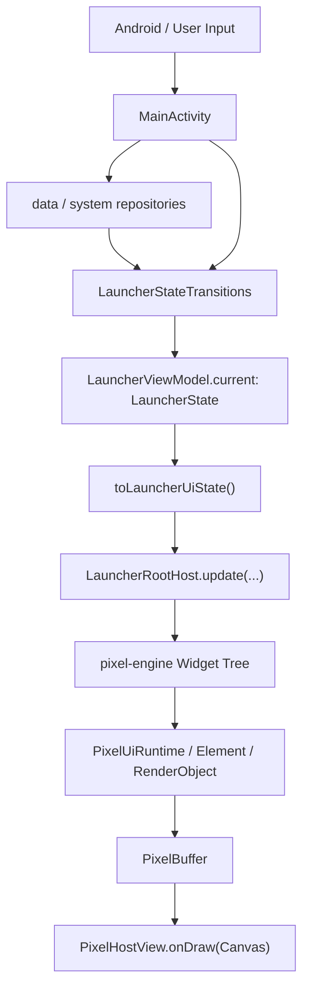

# PixelLauncher 项目总览

本文是 PixelLauncher 的项目事实入口。目标是让新接手的工程师不用通过翻目录和猜代码关系来拼凑项目现状，而是先在这里建立完整心智模型：项目是什么、工程如何分模块、pixel-engine 如何工作、pixel-demo 承担什么验收职责、Launcher 的核心页面如何组织、后续开发应该从哪里下手。

如果只读一份项目文档，先读本文。产品与 app 侧页面设计细节见 [设计文档](设计文档.md)，UI 实现约束见 [PixelLauncher UI 规范](PixelLauncher%20UI规范.md)，engine 内部细节见 [pixel-engine 架构与技术实现](../pixel-engine/docs/架构与技术实现.md)。

## 1. 项目一句话与当前事实

PixelLauncher 是一个面向 Android 手机的像素风桌面启动器。它不是传统图标桌面，目标是用统一、克制的像素 UI 呈现必要状态，减少用户为了确认信息而频繁打开 App。

当前项目事实：

- 主程序通过 pixel-engine widget 树渲染，宿主链路是 `LauncherRootHost` -> `PixelHostView`。
- App 侧主干是单 `Activity`、单一 `LauncherState`、`LauncherViewModel` 持有唯一状态源。
- Home、Drawer、Settings、Idle、SMS、Diagnostics、Data Health、Notification Settings 都由 `LauncherRootHost` 装配为 pixel-engine widget 树。
- `pixel-engine` 是独立 SDK 模块，负责像素 UI runtime、组件、文本、滚动、导航、动画、调试与 Android 宿主桥接。
- `pixel-demo` 是 SDK 验收宿主，用 Finder 分栏式组件目录展示 engine 能力，不承担 PixelLauncher 产品体验。
- UI 规范集中在 `LauncherSpacing`、字体 enum、Settings 控件、TextButton/OutlinedButton、状态栏和页面布局约束上。

当前明确不是：

- 不是 Compose 项目。
- 不是多 Activity / Fragment 页面架构。
- 不是 Android 原生 View 控件树主界面。
- 不是传统图标墙 Launcher。
- 不是完整通知中心。
- 不是系统锁屏替代。
- 不是自由 widget 大屏。

## 2. 工程模块总览

当前 Gradle 模块：

```text
:app         -> :pixel-engine
:pixel-demo  -> :pixel-engine
```

`settings.gradle.kts` 只包含：

- `:app`
- `:pixel-engine`
- `:pixel-demo`

### `:app`

`app` 是 PixelLauncher 主程序，负责产品状态、系统能力接线和页面装配。

它负责：

- Android 入口、生命周期、权限、系统 intent。
- 单一 `LauncherState` 状态源和状态迁移。
- Home / Drawer / Settings / Idle / SMS / Diagnostics 等产品页面。
- 读取系统数据：App 列表、短信、通话、Usage、定位、天气、电池、通知摘要。
- 将产品状态投影为 pixel-engine widget 树。

它不负责：

- engine 通用组件实现。
- engine 公共 API。
- SDK demo coverage。
- Android 系统锁屏替代。

### `:pixel-engine`

`pixel-engine` 是像素 UI SDK，当前作为单一 Gradle module 维护，内部通过 package 分层。

它负责：

- `pixelcore`：像素 buffer、颜色、bitmap、字体、sprite、资源、screen profile、底层动画原语。
- `pixelui`：widget/runtime、element、render object、layout、paint、hit test、input、scroll、navigation、animation、host bridge。
- Android 宿主桥接：`PixelHostView`、`createPixelHostSetup`、IME、insets、frame scheduler、inspector、frame stats。
- SDK 级测试、公共 API gate、二进制 API gate、KDoc coverage、golden/snapshot/fuzz/perf/soak 测试。

它不负责：

- PixelLauncher 页面语义。
- Android 系统服务读取。
- `com.purride.pixellauncherv2` 包引用。
- Launcher 专属主题 token、文案、设置项或状态机。

### `:pixel-demo`

`pixel-demo` 是 pixel-engine 的可交互验收宿主。

它负责：

- 展示 engine 公开组件和核心能力。
- 为 SDK release gate 提供真实可见场景。
- 通过 catalog 测试保证 demo scene 覆盖关键 API。
- 用 Finder 分栏形式展示 UI/UX 组件目录。

它不负责：

- PixelLauncher 产品功能。
- Launcher 数据源和系统权限接线。
- 替代 engine 单元测试。

## 3. 目录架构与分层职责

### 根目录

```text
README.md                     项目入口、运行指南、接手顺序
docs/                         PixelLauncher 项目级文档
app/                          Launcher 主程序
pixel-engine/                 像素 UI SDK
pixel-demo/                   SDK demo / 验收宿主
tools/                        glyph pack、release check、device smoke 等工具
gradle/                       Gradle wrapper 与版本 catalog
```

`docs/` 当前只保留项目级文档：

- `项目总览.md`：项目事实入口。
- `设计文档.md`：产品目标、app 侧架构、页面职责和开发边界。
- `PixelLauncher UI规范.md`：Launcher UI 实现约束。

`pixel-engine/docs/` 只保留 engine 文档：

- `架构与技术实现.md`
- `使用说明与API手册.md`

### `app/src/main/kotlin/com/purride/pixellauncherv2`

```text
app/          运行时编排入口
data/         系统服务、权限、网络、持久化数据源
launcher/     产品状态机、页面模式、模型、布局几何、RootHost
render/       屏幕档位、字体度量、轻量动画节拍
system/       App 启动、窗口模式、屏幕重力映射
ui/screen/    Home、Drawer、Settings、SMS、Idle、Diagnostics 等页面
ui/widget/    Launcher 复用 widget
ui/theme/     Launcher 主题
ui/text/      Launcher 字体栅格适配
util/         时间、标签、节流、状态文案等轻量工具
viewmodel/    LauncherState 持有和 LauncherUiState 投影
```

核心入口：

- `MainActivity.kt`：运行时总编排入口。
- `SmsController.kt`：SMS 子流程编排。
- `LauncherState.kt`：产品状态全集。
- `LauncherStateTransitions.kt`：状态迁移纯函数集合。
- `LauncherViewModel.kt`：唯一状态源。
- `LauncherUiState.kt` / `LauncherUiStateMapper.kt`：渲染投影。
- `LauncherRootHost.kt`：把页面模式装配成 pixel-engine widget 树。

分层原则：

- 系统服务读取放在 `data` 或 `system`，不要放进 `ui/screen`。
- 页面状态变化先进 `LauncherStateTransitions`，不要直接在 UI 层塞临时状态。
- 页面结构放在 `ui/screen`，页面复用件放在 `ui/widget`。
- 列表行距、可见行数、状态栏高度等几何规则放在 `launcher/*Layout` 或 `LauncherSpacing`。
- 字体、baseline、UI 字号由 `PixelFontCatalog` 等受控入口统一，不在页面散落 magic number。

### `pixel-engine/src/main/kotlin/com/purride`

```text
pixelcore/      底层像素能力
pixelui/        UI runtime、组件与 host bridge
pixelengine/    模块 marker namespace
```

`pixelcore` 关注数据和像素原语，例如：

- `PixelBuffer`
- `PixelColor`
- `PixelBitmap`
- `PixelGridGeometry`
- `ScreenProfile`
- `PixelGlyphPack`
- `PixelFontEngine`
- sprite sheet、resource manifest、resource cache

`pixelui` 关注 UI runtime 和组件，例如：

- `Widget` / `Element` / `RenderObject`
- `PixelHostView`
- layout、text、image、custom paint
- scroll、grid、page、sliver
- text field、focus、form、semantics
- navigation、animation、debug overlay、inspector
- controller / state

### `pixel-demo/src/main/kotlin/com/purride/pixeldemo`

```text
app/          demo 字体和 app 侧适配
browser/      Finder 分栏目录首页
catalog/      DemoCategory、DemoScene、DemoTreeCatalog
scaffold/     demo 页面骨架、导航、指标 overlay
settings/     demo 设置
showcase/     各类组件和能力场景
```

核心入口：

- `DemoActivity.kt`
- `DemoCatalog.kt`
- `DemoTreeCatalog.kt`
- `DemoBrowserScene.kt`
- `DemoCatalogCoverageTest.kt`

## 4. 运行时主链路

PixelLauncher 当前主链路是单向状态流：



关键事实：

- `MainActivity` 持有仓库、系统入口、权限请求、刷新节拍和运行时 callback。
- `MainActivity.state` 委托到 `LauncherViewModel.current`，避免 Activity 重建后状态丢失。
- `LauncherStateTransitions` 是状态迁移集中地，适合写纯函数测试。
- `LauncherUiState` 是渲染投影，不应成为第二个业务状态源。
- `LauncherRootHost` 只根据 `uiState.mode` 构建当前页面 widget 树。
- 页面 widget 不应直接读系统服务，也不应绕过 callbacks 改状态。

典型刷新路径：

1. 用户点击、滑动、按键、系统回调或后台数据刷新进入 `MainActivity`。
2. `MainActivity` 调用仓库读取数据，或把输入转成 transition。
3. `LauncherStateTransitions` 生成新 `LauncherState`。
4. `LauncherViewModel` 保存新状态。
5. `renderCurrentFrame()` 把状态映射成 `LauncherUiState` 并提交给 `LauncherRootHost`。
6. `LauncherRootHost` 构建 widget tree，pixel-engine 负责 layout / paint / hit test。

## 5. pixel-engine 核心实现原理

pixel-engine 的设计模型接近 Flutter，但实现是项目自有的 Kotlin / Android Canvas 渲染链路。

三层模型：

```text
Widget
  不可变配置对象：Text、Row、Column、ListView、TextField...
        |
        v
Element
  运行时树：生命周期、State、InheritedWidget、dirty rebuild
        |
        v
RenderObject
  layout + paint + hit-test，最终写入 PixelBuffer
```

渲染主链路：

```text
PixelHostView.setContent(...)
        |
        v
RootWidgetProvider
        |
        v
PixelUiRuntime.render(newWidget)
        |
        v
BuildOwner.updateRootWidget(newWidget)
        |
        v
BuildOwner.buildScope()
        |
        v
PipelineOwner.render()
        |
        v
PixelBuffer
        |
        v
PixelHostView.onDraw(Canvas)
```

### Host bridge

`PixelHostView` 是 Android 与 pixel-engine 的边界。它负责：

- Android `View` 生命周期。
- Canvas 绘制。
- touch/key 输入转发。
- IME 和隐藏输入框桥接。
- window insets / view insets。
- host 背景色、像素网格、像素形状和缩放。
- frame scheduler。
- inspector 和 frame stats。

推荐外部接入入口是 `createPixelHostSetup(...)`，它会组装 `PixelHostView`、默认 `PixelTextInputBridge` 和包含隐藏输入框的 `FrameLayout`。

### Layout / paint / hit test

engine 组件的核心约束：

- layout 必须从父级 constraints 推导尺寸。
- paint 只能画进 layout 后确定的 bounds。
- hit test 必须使用 layout 后的几何，不能用手写屏幕坐标猜测。
- selected / pressed / focused / loading 状态不能改变组件外部尺寸，除非组件 API 明确如此。
- scroll、page、text field 等有长期状态的组件必须通过 controller + state 持有运行状态。

### 文本与字体

engine 的文本链路包括：

- `PixelTextRasterizer`
- `PixelFontEngine`
- `PixelGlyphPack`
- `PixelGlyphPackAssetLoader`
- `PixelBitmapFont`

App 侧使用 Fusion Pixel 字体资源和 glyph pack，并通过 Launcher 字体适配层接入。字体大小不作为用户设置项暴露，页面只能通过受控 enum 选择尺寸。中文、英文、数字混排必须按统一 baseline、cell height 和 ink bounds 验收。

### 滚动、分页与输入

滚动和分页使用 controller + state：

- `PixelListController` / `PixelListState`
- `PixelPagerController` / `PixelPagerState`
- `PixelRefreshIndicatorController` / `PixelRefreshIndicatorState`

输入和焦点使用：

- `TextField`
- `PixelTextFieldController`
- `PixelTextFieldState`
- `PixelTextInputBridge`
- `FocusNode`
- `FocusScope`
- `Form` / `FormField` / validator

这些能力在 engine 中是通用 SDK 能力，Launcher 只能通过参数和回调组合使用，不能把产品语义下沉到 engine。

## 6. pixel-engine 技术规范

### 公共 API

engine 公共 API 必须满足：

- 命名中性，不带 Launcher 产品语义。
- 参数表达通用 UI 行为，而不是特定页面文案或状态。
- 新增公开 API 必须能在 `pixel-demo` 中真实展示。
- 新增公开 API 必须进入公共 API 覆盖测试或对应 regression 测试。
- 不允许 `pixel-engine/src/main` 引用 `com.purride.pixellauncherv2`。

相关门禁：

- `BoundaryOwnershipTest`
- `PublicApiCoverageTest`
- `checkPublicApi`
- `checkBinaryApi`
- `checkKdocCoverage`

### 组件实现

组件实现要求：

- 依赖 constraints 和测量结果，不靠固定尺寸硬算。
- padding、margin、border、text baseline 必须有明确布局语义。
- 组合组件优先用已有基础 widget 实现；只有确实需要底层 layout/paint/hit test 时才写 render object。
- 自定义 render object 通过 `com.purride.pixelui.advanced` 暴露的 alias 使用，不暴露 internal 类型。
- 所有可交互组件必须处理 disabled / pressed / focused 等状态。

### 资源和字体

资源能力包含：

- bitmap loader
- sprite sheet
- animated sprite
- resource manifest
- resource cache

字体能力包含：

- bitmap font
- glyph pack parser
- text rasterizer
- paragraph layout
- rich text
- selection / caret / composition

新增字体或 glyph pack 时应同时更新工具、资源、测试和 UI 规范约束。

### 测试策略

engine 测试覆盖：

- core graphics / font / screen / animation。
- retained runtime / element / render pipeline。
- widget composition、layout、text field、scroll、navigation、animation。
- golden / element snapshot。
- fuzz / lifecycle soak / performance smoke。
- public API coverage。

不要只靠 demo 证明 engine 正确；demo 是可视验收，单元和 regression 测试是行为门禁。

## 7. pixel-demo 职责与实现规范

pixel-demo 是 SDK 验收宿主，不是 PixelLauncher 产品 demo。

当前 demo 目录按 UI/UX 组件分类：

- 布局
- 文本
- 输入
- 控件
- 反馈
- 滚动
- 绘制
- 动效
- 导航
- 调试

首页使用 Finder 分栏式目录：

- 第一列显示组件分类。
- 第二列显示分类下细分 scene。
- leaf scene 是独立可打开页面。
- 首页不承担搜索主路径，但 `DemoCatalog.search(...)` 保留给测试和未来入口。

新增 engine 能力时，demo 要做到：

- 新能力有真实 scene，不写空白说明页。
- scene 只展示 SDK 能力，不引入 Launcher 产品语义。
- scene 的 `id`、`title`、`summary`、`apis` 保持非空。
- 新 API 能被 `DemoCatalogCoverageTest` 搜到。
- 若是动画、导航、资源、状态恢复、inspector、性能能力，要提供可交互状态或可观察指标。

demo scaffold 负责：

- demo 导航。
- 指标 overlay。
- demo-only env。
- settings。
- 页面骨架。

demo 不负责：

- 读取真实系统 SMS、Usage、Call Log、Location。
- 展示 Launcher Home / Drawer / Settings 产品页面。
- 替代 engine 单元测试。

## 8. Launcher 核心模块

### Home

Home 是必须看信息页，不是启动器大厅。

当前职责：

- 日期、星期、时间上下文。
- 天气常显行。
- 下一次闹钟。
- 未接电话、未读短信、降雨提醒、通知摘要等重要状态。
- 屏幕使用时长和打开次数。
- 数据健康摘要。
- 底部 `CALL` / `SMS` 文本按钮。

核心模型：

- `HomeInfoModel`
- `HomeInfoDetailModel`
- `HomeStateBlockModel`
- `WeatherAttentionModel`

开发规则：

- Home 不做 Dashboard。
- 重要信息必须有优先级。
- 数据缺权限、无数据、刷新失败必须有可解释状态。
- Home 状态行不能挤占天气常显行。
- 新 Home 信息先进入模型和测试，再接入 UI。

### Drawer

Drawer 是 App 搜索和启动工具，不是全局搜索。

当前职责：

- 纯文本 App 列表。
- 状态栏搜索入口。
- ASCII 输入代理。
- 中文、拼音全拼、拼音首字母、英文标签、包名派生命中。
- 别名和重命名。
- lightweight app action menu。
- App 缓存刷新。

核心模型：

- `DrawerSearchSupport`
- `DrawerAsciiInputSanitizer`
- `AppDrawerIndexModel`
- `DrawerAlphaIndexModel`
- `DrawerContentTapResolver`
- `AppCustomizationRepository`

开发规则：

- Drawer 只搜索 App。
- SMS、联系人、设置项、网页、计算器不进入 Drawer。
- 别名影响搜索，不挤占列表行。
- 列表行只显示最终 App 标题。
- 搜索质量必须有排序和命中来源测试。

### Settings

Settings 是单页完整设置系统。

当前职责：

- Display、Home、Drawer、Idle、Data、Advanced 等分组。
- 外观、像素形状、pixel gap、主题。
- Drawer 对齐、自动搜索。
- Idle 开关、充电自动进入、无操作自动进入、超时、充电效果。
- App 管理、Notification Settings、Data Health、Diagnostics 入口。

核心模型：

- `SettingsMenuModel`
- `SettingsMenuLayout`
- `SettingsControls`
- `FontSettingsRepository`

开发规则：

- 设置点击尽量即时生效。
- Settings 不暴露 font size 或 fontStyle 用户选择。
- 字体尺寸由 UI 通过受控 enum 决定。
- 控件行左右对齐，左侧文字和右侧状态必须同一行。
- switch / segmented control / option stepper 使用统一组件，不在页面手写变体。

### Idle

Idle 是 Launcher 内部待机页，不是系统锁屏替代。

当前职责：

- 独立 `LauncherMode.IDLE`。
- 无操作自动进入，默认 30s。
- 充电自动进入。
- 夜间降低亮度。
- 充电态降低信息密度。
- 默认态、充电态、低电量态、天气风险态、通知摘要态。

核心模型：

- `IdleAutoEntryPolicy`
- `IdleSettings`
- `IdleStatusModel`
- `IdlePresentationModel`

开发规则：

- Idle 不实现 PIN、密码、生物识别或 root 锁屏替代。
- 进入和退出必须与 Home / Drawer / Settings / SMS 页面切换稳定协作。
- 同一时刻突出一个主题，不堆叠复杂 Dashboard。
- 防烧屏暂不作为当前职责。

### SMS

SMS 是 Launcher 内完整短信子流程，不只是轻入口。

当前职责：

- 默认短信角色申请。
- SMS / MMS receiver。
- 线程列表。
- 会话详情。
- 未读收件箱。
- 草稿输入、发送、发送状态。
- 联系人名称映射。
- 验证码识别和快速复制。
- 线程内搜索。
- Home 未读短信摘要直达。

核心入口：

- `SmsController`
- `SmsRepository`
- `UnreadSmsRepository`
- `SmsContactResolver`
- `SmsThreadSearchModel`
- `SmsVerificationCodeModel`
- `SmsMessageStatusModel`
- `SmsThreadsScreen`：短信首页，固定两页 `UNREAD` / `ALL`
- `SmsThreadDetailScreen`

开发规则：

- SMS 搜索只存在于 SMS 内部，不进入 Drawer。
- SMS 首页默认进入 `UNREAD` 页，右侧 `ALL` 页显示全部会话；底部 Tab 与横向 PageView 同步。
- SMS 首页右上角 `READ` 按钮用于将当前所有未读短信标记为已读。
- 权限缺失和默认短信角色缺失必须有可见状态。
- 首次进入、空线程、长文本、发送失败不能显示空白或裁切状态。
- 发送失败保留草稿，用户可重发。

### StatusBar / Toast

状态栏是全局顶部信息区域，同时承担临时消息显示位置。

当前职责：

- 左侧时间。
- 右侧页面标识。
- 电量线。
- Drawer 搜索状态栏。
- 临时消息出现时隐藏普通状态栏元素，但电量线保留。

核心入口：

- `LauncherHeader`
- `LauncherSearchHeader`
- `BatteryDividerWidget`
- `LauncherHeaderLayout`
- `LauncherState.statusBarMessageText`

开发规则：

- 状态栏左右 padding 使用统一 spacing 常量。
- 临时消息作为 Toast 使用，不新增独立浮层。
- 状态栏真实高度来自 Android status bar inset 与 Launcher header layout。

### Data Health

Data Health 是数据可解释性入口，负责说明 Home 为什么为空、为什么失败、如何修复。

当前职责：

- Usage Access。
- Location。
- Call Log。
- SMS Read / SMS App / SMS Send。
- Notification Post。
- Notification Listener。
- 刷新时间。
- 修复动作映射。

核心模型：

- `DataHealthModel`
- `DataHealthRepairActionModel`
- `DataHealthScreen`

开发规则：

- 每个可修复异常都要有明确入口。
- Data Health、Home 摘要、Diagnostics 摘要必须来自同一模型。
- 状态刷新后 UI 应及时反映最新结果。

### Diagnostics

Diagnostics 是 Advanced 下的高级诊断页，不承担普通用户主路径。

当前职责：

- Data Health 摘要。
- Home 摘要。
- 字体 metrics。
- display / status bar inset。
- battery。
- bounds snapshot。
- text sample width 和风险。
- `DEBUG DATA HEALTH` 入口。

核心模型：

- `DiagnosticsModel`
- `DiagnosticsBoundsModel`
- `DiagnosticsTextSampleModel`
- `DiagnosticsScreen`

开发规则：

- 诊断信息短、明确、可复现。
- 调试入口不影响普通用户路径。
- UI 裁切问题优先通过 Diagnostics 定位，再做页面修复。

### Notification Summary

Notification Summary 是 Home / Idle 的通知摘要能力，不是完整通知中心。

当前职责：

- 监听通知来源。
- ongoing 过滤。
- 静音来源过滤。
- 显式优先来源。
- 最多 2 个来源和剩余 `+N`。
- Settings 中 App 级 `NORMAL / PRIORITY / MUTED` 配置。

核心入口：

- `LauncherNotificationListenerService`
- `NotificationSummaryRepository`
- `NotificationSummarySettingsRepository`
- `NotificationSummaryModel`
- `NotificationSettingsModel`
- `NotificationSettingsScreen`

开发规则：

- 不展示完整通知流。
- Home / Idle 只显示一行摘要。
- 点击单一来源可打开对应 App，否则进入系统通知设置或配置页。

## 9. 数据源、权限与系统能力

### 数据源

当前关键数据源：

- App 列表：`PackageManagerAppRepository`
- App 重命名和别名：`AppCustomizationRepository`
- 启动次数：`LauncherStatsRepository`
- 电池与充电：`DeviceStatusRepository`
- 下一次闹钟：`NextAlarmRepository`
- 屏幕使用时长和打开次数：`ScreenUsageRepository` / `ScreenUsageSummaryModel`
- 未接来电和未读短信：`CommunicationStatusRepository`
- SMS 线程、消息、发送：`SmsRepository`
- 未读短信收件箱：`UnreadSmsRepository`
- 联系人映射：`SmsContactResolver`
- 通知摘要：`NotificationSummaryRepository`
- 通知配置：`NotificationSummarySettingsRepository`
- 定位：`DeviceLocationRepository`
- 降雨预测：`RainForecastRepository`
- 外观与行为设置：`FontSettingsRepository`

### 权限和系统角色

Manifest 中的关键权限：

- `INTERNET`
- `ACCESS_COARSE_LOCATION`
- `ACCESS_FINE_LOCATION`
- `READ_CALL_LOG`
- `READ_SMS`
- `SEND_SMS`
- `RECEIVE_SMS`
- `READ_CONTACTS`
- `RECEIVE_MMS`
- `RECEIVE_WAP_PUSH`
- `POST_NOTIFICATIONS`
- `PACKAGE_USAGE_STATS`

关键系统事实：

- Usage Access 不是普通运行时权限，必须跳转系统设置。
- Notification Listener 需要用户在系统设置中授权。
- SMS 完整能力需要默认短信角色。
- Contacts 权限用于联系人名映射；缺失时回退号码显示。
- telephony feature 声明为 optional，避免非 telephony 设备无法安装。
- App 启动通过 `AndroidAppLauncher` 封装。
- window / fullscreen / insets 行为通过 `WindowModeController`、`LauncherHeaderLayout` 等集中处理。

开发规则：

- 新数据能力必须设计权限缺失态、空数据态、失败态和 Settings/Data Health 入口。
- 系统 intent 和平台差异封装在 `system` 或 `data` 层。
- UI 页面只消费状态，不直接读取 ContentResolver 或系统服务。

## 10. UI 与设计系统摘要

完整规则见 [PixelLauncher UI 规范](PixelLauncher%20UI规范.md)。这里列开发时必须记住的核心约束。

UI 总原则：

- 以像素文本为核心，低信息密度但高可读性。
- 不用固定宽高硬凑布局，优先依赖组件测量、父级约束和 `Expanded`。
- 文本完整显示优先于视觉装饰。
- selected / pressed / loading 状态不能改变布局尺寸。
- 不使用传统图标墙、卡片堆叠或复杂装饰。

字体规则：

- Settings 不提供 font size 设置。
- Settings 不提供 fontStyle 设置。
- 页面只能通过受控 enum 选择字体尺寸。
- 中文、英文、数字混排必须看 baseline、cell height、ink bounds。

Spacing 规则：

- 页面级边距、状态栏左右边距、行距、控件内边距集中使用 `LauncherSpacing`。
- 状态栏和 Home 底部动作区也纳入 spacing 规则。
- 修改间距先改常量和注释，再更新受影响组件。

控件规则：

- 无边框文本命令使用 TextButton。
- 有边框按钮使用 OutlinedButton，边框与文字的 padding 必须稳定。
- Switch 和 segmented control 通过 Settings 统一组件实现。
- Settings 左侧选项和右侧状态组件必须同一行对齐。

真机规则：

- 开发侧不把常规真机截图作为阻塞项。
- 真机显示问题由用户主动反馈后按具体页面修复。
- 发现真机裁切、贴边、压缩问题时，优先补模型/静态测试/spacing 约束，避免只靠局部硬编码。

## 11. 测试与发布门禁

常用命令：

```bash
./gradlew :app:testDebugUnitTest
./gradlew :pixel-engine:testDebugUnitTest
./gradlew :pixel-demo:testDebugUnitTest
./tools/pixel-release-check.sh
```

`tools/pixel-release-check.sh` 当前包含：

- `:pixel-engine:checkPublicApi`
- `:pixel-engine:checkBinaryApi`
- `:pixel-engine:checkKdocCoverage`
- `:pixel-engine:testPixelGlyphPackConverter`
- `:pixel-engine:testDebugUnitTest`
- `:pixel-engine:lintDebug`
- `:pixel-engine:assembleDebug`
- `:pixel-demo:assembleDebug`
- `:pixel-demo:testDebugUnitTest`
- `:pixel-engine:publishToMavenLocal --dry-run`
- `mkdocs build --strict`

App 侧重点测试：

- `LauncherStateTransitionsTest`：页面和状态迁移。
- `HomeInfoModelTest` / `HomeInfoDetailModelTest`：Home 信息优先级和详情。
- `DrawerQueryTransitionsTest` / `DrawerSearchSupportTest`：Drawer 搜索质量。
- `SettingsMenuModelTest` / `SettingsMenuLayoutTest`：Settings 设置模型和视口。
- `IdleAutoEntryPolicyTest` / `IdleStatusModelTest` / `IdlePresentationModelTest`：Idle 触发和展示。
- `DataHealthModelTest` / `DataHealthRepairActionModelTest`：数据异常和修复入口。
- `DiagnosticsModelTest` / `DiagnosticsBoundsModelTest` / `DiagnosticsTextSampleModelTest`：高级诊断。
- `Sms*Test`：短信搜索、验证码、状态、格式化。
- `UiSpecStaticTest`：UI 规范静态约束。
- `ManifestContractTest`：manifest 权限与入口约束。

Engine 侧重点测试：

- `BoundaryOwnershipTest`
- `PublicApiCoverageTest`
- `EngineGoldenTest`
- `ElementTreeSnapshotTest`
- `EngineFuzzTest`
- `EngineLifecycleSoakTest`
- `EnginePerformanceSmokeTest`
- render pipeline、text field、scroll、navigation、animation、controller 相关测试。

Demo 侧重点测试：

- `DemoCatalogCoverageTest`
- scene id / title / summary / apis 非空。
- scene 搜索能命中关键 API。
- category / tree catalog 顺序和分类覆盖。

纯文档变更通常只需要：

```bash
git diff --check
rg -n "待检查的文档名或入口" .
python3 -m mkdocs build --strict
```

如果本机没有 mkdocs，`tools/pixel-release-check.sh` 会尝试安装；单独验证时也可以记录未运行原因。

## 12. 如何新增功能

### 新增 Home 信息

推荐路径：

1. 在 `data` 层读取或持久化数据。
2. 在 `launcher` 层新增纯模型或扩展 `HomeInfoModel`。
3. 在 `LauncherState` / `LauncherUiState` 增加必要字段。
4. 在 `LauncherStateTransitions` 中集中迁移状态。
5. 在 `HomeScreen` 中只消费 `uiState`。
6. 补模型测试和状态迁移测试。

禁止：

- 直接在 `HomeScreen` 读取系统服务。
- 直接在 UI 层决定跨数据源优先级。
- 把 Home 做成 Dashboard。

### 新增 Settings 项

推荐路径：

1. 在 `SettingsMenuItem` 和 `SettingsMenuModel` 增加行定义。
2. 在 `FontSettingsRepository` 或对应 repository 增加持久化字段。
3. 在 `LauncherStateTransitions.updateUiBehavior` 或专门 transition 中写入状态。
4. 在 `MainActivity.onSettingsItemAction` 接线。
5. 在 `SettingsScreen` 复用现有 Settings 控件。
6. 补 `SettingsMenuModelTest`、布局/静态 UI 测试。

禁止：

- 在页面里手写新的 switch 外观。
- 为字体大小、fontStyle 暴露用户设置。
- 绕开 repository 直接写 SharedPreferences。

### 新增 Drawer 搜索能力

推荐路径：

1. 扩展 `DrawerSearchSupport` 的 metadata。
2. 在 `LauncherStateTransitions.filterDrawerApps` 使用新的命中源。
3. 保留命中解释在模型和测试中。
4. UI 列表仍只显示 App 标题。
5. 补 `DrawerSearchSupportTest` 和 `DrawerQueryTransitionsTest`。

禁止：

- Drawer 搜索联系人、短信、设置项、网页或命令。
- 在列表行显示 `PINYIN`、`ALIAS`、`PACKAGE` 等调试标签。

### 新增 SMS 能力

推荐路径：

1. 系统读写进入 `SmsRepository` / `UnreadSmsRepository` / 新 data 类。
2. 流程编排进入 `SmsController`。
3. 状态字段进入 `LauncherState` 和 `LauncherUiState`。
4. 页面展示进入 `Sms*Screen`。
5. 纯规则进入 `launcher` 模型并补测试。

禁止：

- SMS 搜索进入 Drawer。
- 会话详情长文本被裁切。
- 权限或默认短信角色缺失时显示空白。

### 新增 engine 组件

推荐路径：

1. 判断是否是通用 SDK 能力。
2. 在 `pixelcore` 或 `pixelui` 合适 package 实现。
3. 如果只是组合能力，优先用现有 widget 组合。
4. 只有需要底层 layout / paint / hit test 时才新增 render object。
5. 在 `pixel-demo` 增加可交互 scene。
6. 更新 API coverage、golden/snapshot/behavior 测试。
7. 通过 release check。

禁止：

- 把 Launcher 文案、状态、颜色 token、业务模型下沉到 engine。
- 新增没有 demo 和测试的公开 API。

## 13. 明确不做与架构红线

产品红线：

- 不做传统图标墙。
- 不做自由 widget 大屏。
- 不做完整通知中心。
- 不做默认联网搜索。
- 不在 Launcher 中处理系统锁屏替代。
- 不引入复杂主题市场。
- 不做强干预数字健康。
- Drawer 不搜索联系人、短信线程、设置项、网页、计算器或命令。

工程红线：

- 不把主界面改写成 Compose。
- 主界面页面只通过 pixel-engine widget 链路实现。
- 不把 Android 原生控件树混进像素主界面。
- 不绕过 `LauncherState` 直接塞 UI 状态。
- 不把系统服务读取塞进 `ui/screen`。
- 不让 `pixel-engine` 依赖 `:app` 或 `com.purride.pixellauncherv2`。
- 不把产品页面语义放进 engine。

文档红线：

- README 保持入口和运行指南，不扩写成百科。
- 本文保持项目事实入口，不写临时任务清单。
- 设计文档写产品和 app 侧设计，不重复 engine 手册。
- UI 规范写可执行 UI 约束，不写泛泛设计口号。

## 14. 接手阅读顺序

第一次接手建议顺序：

1. 根目录 `README.md`。
2. 本文档。
3. `docs/设计文档.md`。
4. `docs/PixelLauncher UI规范.md`。
5. `app/src/main/kotlin/com/purride/pixellauncherv2/app/MainActivity.kt`。
6. `app/src/main/kotlin/com/purride/pixellauncherv2/launcher/LauncherState.kt`。
7. `app/src/main/kotlin/com/purride/pixellauncherv2/launcher/LauncherStateTransitions.kt`。
8. `app/src/main/kotlin/com/purride/pixellauncherv2/viewmodel/LauncherUiState.kt` 和 `LauncherUiStateMapper.kt`。
9. `app/src/main/kotlin/com/purride/pixellauncherv2/launcher/LauncherRootHost.kt`。
10. `app/src/main/kotlin/com/purride/pixellauncherv2/ui/screen` 下的页面。
11. 如果涉及 engine，读 `pixel-engine/docs/架构与技术实现.md`。
12. 如果要使用或扩展 SDK API，读 `pixel-engine/docs/使用说明与API手册.md`。
13. 如果要新增或验收 engine 能力，读 `pixel-demo/src/main/kotlin/com/purride/pixeldemo/catalog` 和对应 showcase。

按任务类型快速定位：

- Home 信息问题：`HomeInfoModel`、`HomeInfoDetailModel`、`HomeScreen`。
- Drawer 搜索问题：`DrawerSearchSupport`、`LauncherStateTransitions`、`DrawerScreen`。
- Settings 问题：`SettingsMenuModel`、`SettingsControls`、`SettingsScreen`。
- Idle 问题：`IdleAutoEntryPolicy`、`IdleStatusModel`、`IdleScreen`。
- SMS 问题：`SmsController`、`SmsRepository`、`Sms*Screen`。
- UI 裁切/间距问题：`LauncherSpacing`、`PixelFontCatalog`、`UiSpecStaticTest`、`Diagnostics*Model`。
- engine 组件问题：`pixel-engine/docs/架构与技术实现.md`、对应 widget/render/test/demo scene。
